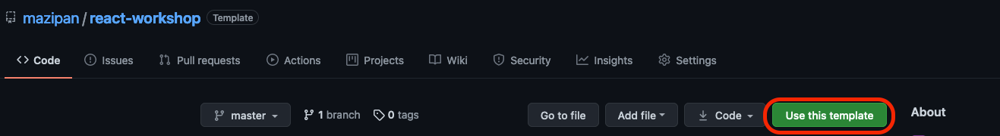

# react-workshop

⚛️ A workshop to get started with React

## Scope of workshop

- React 101 + Graphql
- Web Performance
- SEO for web developer

## Tech stacks

- Boilerplate using [Razzle](https://razzlejs.org/getting-started)
- React.js
- Apollo

## Checkout

- Clone the repo to your local

```bash
$ git clone git@github.com:mazipan/react-workshop.git
```

- Or click "Use this template" to create your own repo



## Installation

- Move to the project's directory

```bash
$ cd react-workshop
```

- Install dependency

```bash
$ npm i
```

- Run the project

```bash
$ npm run dev
```

Open in `http://localhost:3000/`

## Commands

| Command         | Description                                        |
| --------------- | -------------------------------------------------- |
| `npm run dev`   | Run development mode with HMR                      |
| `npm run build` | Build the project for production deployment        |
| `npm run prod`  | Run the project after build, to replicate prod env |

---

© 2021 from 🇮🇩
